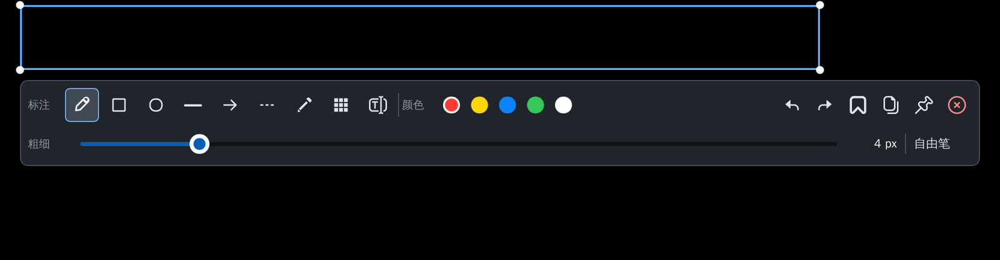
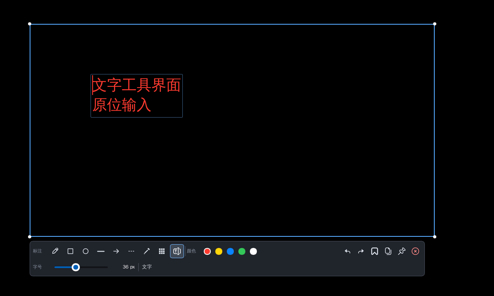
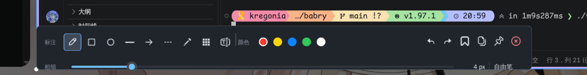

<div align="center">
  

  # Babry

  **一款为 Linux Wayland 打造的、懂边界的截图工具。**

  悬停吸附 · 单击确认 · 拖动精修 · 原位标注 · 一键复制

  <p>
    <a href="https://github.com/kregonia/babry/actions/workflows/cargo-linux-multiarch.yml"></a>
    <a href="https://github.com/kregonia/babry/blob/main/LICENSE"></a>
    <a href="https://www.rust-lang.org/"></a>
    <a href="https://github.com/kregonia/babry/stargazers"></a>
  </p>

  <p>
    <a href="#快速开始">快速开始</a> ·
    <a href="#为什么是-babry">为什么是 Babry</a> ·
    <a href="#交互方式">交互方式</a> ·
    <a href="#开发者">开发者</a>
  </p>
</div>

<br>

<div align="center">
  
</div>

## 为什么是 Babry

传统截图工具通常让你在“手动框选”和“调用桌面环境原生选择器”之间二选一。Babry 走第三条路：**截取整屏后，用本地 CV 分析边缘和轮廓，在鼠标悬停时给出最可能的目标区域。**

你可以：

- **悬停就吸附**到窗口、面板、卡片或控件；
- **单击就确认**，不需要反复调整边框；
- **拖动就精修**，任何时候都能切换为像素级手动框选；
- 在同一个界面完成标注、文字、复制、保存和贴图。

> [!NOTE]
> Babry 当前优先适配 Linux Wayland / niri。CV 选区使用 Rust 的 `imageproc` 内置实现，不依赖 `slurp`、niri 选区 IPC 或系统 OpenCV 动态库。

## 预览

### 智能选区与编辑器

<div align="center">
  
</div>

悬停目标区域时，Babry 会显示候选框、尺寸和四角控制点；进入编辑后，选区外区域自动变暗，视觉焦点留在需要保存的内容上。

### 原位文字输入

<div align="center">
  
</div>

文字工具参考 PixPin 的输入体验：点击画布后直接输入，文字显示在原位置；字号和颜色在工具栏实时调整，输入效果与最终导出保持一致。

### 工具栏细节

<div align="center">
  
</div>

工具栏提供自由笔、矩形、椭圆、直线、箭头、虚线、高亮、马赛克/模糊、文字、撤销、重做、保存、复制和贴图。

## 功能一览

| 能力 | 体验 |
| --- | --- |
| **CV 智能选区** | Canny 边缘 + 轮廓/连通区域分析；悬停吸附、单击确认、拖动精修 |
| **全屏截图** | `grim` 获取当前 Wayland 桌面，`--screen` 直接进入编辑 |
| **标注工具** | 自由笔、矩形、椭圆、直线、箭头、虚线和半透明高亮 |
| **隐私处理** | 局部马赛克与连续轨迹模糊，可调节模糊度 |
| **原位文字** | 直接在画布输入，多行换行；字号、字体和颜色与导出同步 |
| **工作流** | 实时预览、撤销/重做、保存 PNG、复制到剪贴板、Wayland 贴图 |
| **轻依赖** | Rust + Slint + imageproc；不要求系统 OpenCV、slurp 或 niri 选区命令 |

## 快速开始

### 1. 安装运行依赖

Babry 需要一个 Wayland 截图后端和剪贴板工具：

```text
grim
wl-clipboard
```

可选的 `notify-send` 用于状态通知。

Arch Linux：

```bash
sudo pacman -S grim wl-clipboard libnotify
```

### 2. 构建

```bash
git clone https://github.com/kregonia/babry.git
cd babry
cargo build --release
```

生成的二进制文件：

```text
target/release/babry
```

将它放入 `PATH`：

```bash
install -Dm755 target/release/babry ~/.local/bin/babry
```

### 3. 开始截图

```bash
babry                  # CV 智能区域截图：悬停吸附，单击确认
babry --smart          # 同上，显式使用智能选区
babry --screen         # 截取全屏并直接进入编辑
babry --pin image.png  # 将已有 PNG 作为屏幕贴图
babry --help           # 查看完整帮助
```

`--window` 和 `-w` 仍作为兼容别名保留，但现在使用 Babry 自己的 CV 选区，不调用 `niri msg`。

## 交互方式

### 选区阶段

1. 移动鼠标：CV 检测器实时更新候选区域。
2. 单击：确认当前候选，进入编辑阶段。
3. 按住拖动：移动超过 3px 后切换为手动框选。
4. 松开：确认手动区域。
5. `Esc`：取消截图。

### 编辑阶段

- **标注**：选择工具后在选区内拖动。
- **文字**：选择 `字` 工具，在选区内点击即可原位输入。
- **确认文字**：点击画布外、切换工具或按 `Ctrl+Enter`。
- **取消文字**：`Esc`。
- **字号/颜色**：输入过程中也可以从工具栏实时修改。
- **历史**：`Ctrl+Z` 撤销，`Ctrl+Shift+Z` 或 `Ctrl+Y` 重做。
- **导出**：`Ctrl+S` 保存，`Ctrl+C` 复制，工具栏上的图钉用于贴图。

### 贴图阶段

通过工具栏的贴图按钮，Babry 会把当前选区导出后以 Wayland layer-shell Top layer 显示：

- 左键拖动：移动贴图
- 滚轮：缩放贴图
- 右键：关闭贴图
- `Esc`：关闭获得焦点的贴图

## niri 配置

Babry 不依赖 niri 来完成选区，但可以用 niri 的窗口规则让编辑器以全屏方式显示。将以下内容放入你的规则文件：

```kdl
window-rule {
    match app-id=r#"^babry$"#
    open-fullscreen true
    open-focused true
}
```

修改后重新加载：

```bash
niri msg action load-config-file
```

推荐快捷键：

```kdl
binds {
    Mod+Shift+S { spawn "babry"; }
    Mod+Shift+F { spawn "babry" "--screen"; }
}
```

## 字体配置

文字标注会优先使用 `BABRY_FONT` 指定的字体，并尝试系统中文字体。适合中文环境的示例：

```bash
export BABRY_FONT=/usr/share/fonts/wenquanyi/wqy-zenhei/wqy-zenhei.ttc
export BABRY_FONT_INDEX=0
babry
```

TrueType Collection（`.ttc`）可以通过 `BABRY_FONT_INDEX` 选择字体索引。输入阶段和导出阶段使用同一字体来源，减少“输入时一种字体、保存后另一种字体”的偏差。

## 技术路线

```text
Wayland 桌面
    │
    ▼
  grim ──► 原始 PNG ──► imageproc CV 检测器
                              │
                              ▼
                      Slint 选区交互层
                              │
                              ▼
                    Slint 标注编辑器
                      │      │      │
                      ▼      ▼      ▼
                   PNG 保存  剪贴板  layer-shell 贴图
```

### 项目结构

```text
src/
├── capture.rs          # grim 截图、通知和剪贴板
├── cli.rs              # 命令解析与帮助文本
├── core/
│   ├── geometry.rs     # 像素几何与归一化坐标
│   └── history.rs      # 撤销/重做历史
├── editor.rs           # 标注模型、字体、预览与导出渲染
├── pin.rs              # Wayland layer-shell 贴图
├── selection.rs        # Canny、轮廓、连通组件与候选区域
├── lib.rs              # 库模块导出
└── main.rs             # Slint 控制器和应用工作流

ui/
├── app.slint           # 选区、输入、工具栏和编辑器界面
└── static/             # 工具栏 SVG 图标
```

## 开发者

常用验证命令：

```bash
cargo fmt --all
cargo check --locked
cargo test --all-targets
cargo clippy --all-targets -- -D warnings
cargo build --release --locked
```

当前测试覆盖 CLI、几何、历史、编辑渲染、字体文字导出、贴图尺寸和 CV 选区候选。

## 当前边界

- 编辑器在 niri 下依赖 `open-fullscreen` 窗口规则；未配置时会按普通窗口显示。
- CV 识别不到明确边界时会回退到全屏，仍可拖动鼠标精确框选。
- 多显示器贴图管理、OCR、贴图持久化和滚动长截图尚未实现。

## 参与贡献

欢迎提交 Issue、改进建议和 Pull Request。特别欢迎：

- 不同 Wayland 合成器上的兼容性反馈；
- 中英文、日韩文字体的渲染样例；
- CV 选区误判截图与可复现图片；
- 新标注工具和更顺手的快捷键设计。

如果 Babry 对你的工作流有帮助，欢迎点一个 ⭐，它会帮助项目被更多 Wayland 用户发现。

## License

[Apache License 2.0](LICENSE)
